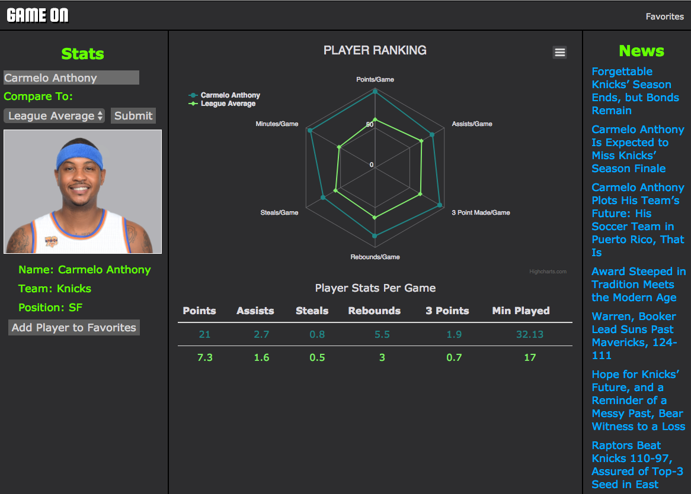

# Game On
---

## About
Game On is a full-stack web applicaiton for visualizing sports data from the NBA. It allows users to visualize player and team stats like never before and perform analyses that have previously been difficult to render. Users can log in with a user name and password, save favorite players, and build visualization charts from player data.
Users also get an automatically-updated basketball news feed to keep them up to date on the latest action around the league.
## Project Contributors
* <a href="https://github.com/cshall13">Shane Hall</a>
* <a href="https://github.com/chadm9">Chad McKee</a>
* <a href="https://github.com/VinozzZ">Yingrong Zhao</a>
* <a href="https://github.com/henaege">Drew Tolliver</a>

## Languages and Technologies
* Node.js
* Express
* MySQL
* JavaScript
* jQuery
* HTML
* CSS
* Highcharts.js


## Dependencies and Plugins
* express
* express-session
* body-parser
* mysql node
* mysportsfeeds.com API
* newsapi.org API
* jquery.mb.YTPlayer
* Bootstrap
* Google Fonts


## Site Walkthrough

### Landing Page
Users are treated to a full-page background video with a simple logo, log in button (for registered users), and a Get Started button (for unregistered users). An About button gives new users a summary of the site.
The Get Started button takes a new user to a registration form where they can enter a user name and password. User inputs are sanitized to avoid insertion attacks and all passwords are encrypted and securely stored in our SQL database.
<p align='center'>
    </img>
</p>

### User Page
After logging in users are brought to the User page. On first load, the stats for one of the NBA's top players are rendered and displayed in the center of the page. The controls on the left allow the user to build their own chart based on players of their choosing.
Our backend uses express to query the database and the data is rendered by Highcharts.js. Pages are rendered via Pug (Jade).
Along the right side of the page a news feed allows quick reference for keeping up with the latest events around the league.
<p align='center'>
    </img>
</p>


## Code Examples


### Data Rendering


The following front-end snippet demonstrates the rendering of player data
to a spider chart via the Higcharts module.

```JavaScript
Highcharts.chart('charts', {

    chart: {
        backgroundColor: 'rgba(1,1,1,0)',
        polar: true,
        type: 'line'

    },

    title: {
        text: 'Player Ranking',
        x: -0
    },

    pane: {
        size: '80%'
    },

    xAxis: {
        categories: ['Points/Game', 'Assists/Game', '3 Point Made/Game', 'Rebounds/Game',
                'Steals/Game', 'Minutes/Game'],
        tickmarkPlacement: 'on',
        lineWidth: 0,
    },

    yAxis: {
        gridLineInterpolation: 'polygon',
        lineWidth: 0,
        min: 0,
        max: 100,
        
    },

    tooltip: {
        shared: true,
        pointFormat: '<span style="color:{series.color}">{series.name}: <b>{point.y:,.0f}%</b><br/>'
    },

    legend: {
        align: 'bottom',
        verticalAlign: 'top',
        y: 70,
        layout: 'vertical'
    },

    series: [{
        name: fullName,
        data: [parseFloat(PPGrank),parseFloat(ASSrank), parseFloat(THREErank), parseFloat(REBrank), parseFloat(STLrank), parseFloat(MINrank)],
        pointPlacement: 'on'
    }, {
        name: compName,
        data: [parseFloat(compPPGrank),parseFloat(compASSrank), parseFloat(compTHREErank), parseFloat(compREBrank), parseFloat(compSTLrank), parseFloat(compMINrank)],
        pointPlacement: 'on'
    }]

});
```

This back-end code snippet handles a user post request for adding a new player to their 
favorites list.  First a SQL query is made to ascertain whether that player already exists in their
favorites list.  If so, the user is redirected to a page which renders that player's data.  If not,
the selected player is first added to their favorites list before redirecting the user.


```JavaScript
router.post('/add_fav', (req,res)=>{
    var fav = req.body.favorite;
    var user_email = req.session.email;
    req.session.registered = false;
    var favQuery = "INSERT INTO fav_player(user_email, player_id) VALUES (?, ?);";
    var alreadyAddedQuery = `SELECT player_id, user_email FROM fav_player WHERE user_email = '${user_email}' AND player_id = '${fav}';`;

    connection.query(alreadyAddedQuery, (error, results)=>{
        if(error)throw error;
        if(results.length > 0){
            req.session.currentPlayer = fav;
            res.redirect(`/user?msg=addedPlayer`);
        }else{
            connection.query(favQuery,[user_email, fav], (error, results)=>{
                if(error)throw error;
                req.session.currentPlayer = fav;
                res.redirect(`/user?msg=addedPlayer`);
            });
        }
    });
});
```

<br>

